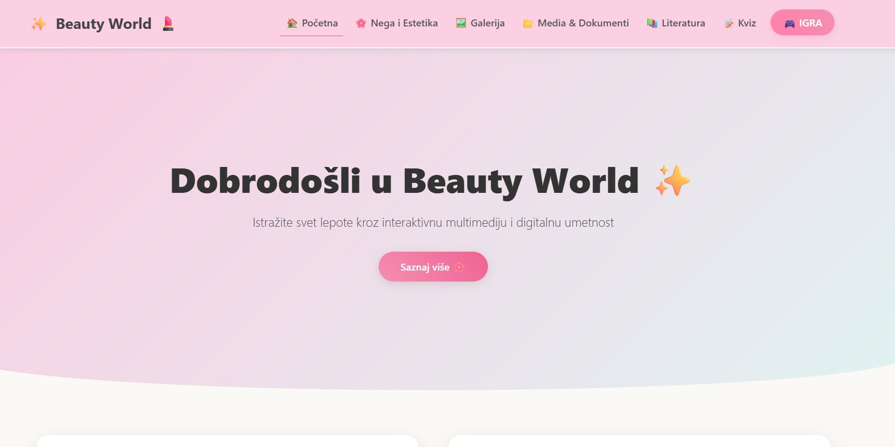

# Beauty World | ✨ Multimedia Web Application

Welcome to **Beauty World**, a visually rich, interactive, and fully responsive multimedia web application. This project is a comprehensive conceptual platform dedicated to skincare, cosmetics, and beauty tech, designed to deliver an engaging user experience through digital art, educational content, and interactive features.

---

## 🚀 Technologies Used

* **Frontend Structure:** HTML5
* **Styling & UI:** CSS3, Bootstrap 5 Framework (for layout & custom elements)
* **Logic & Interaction:** JavaScript (Vanilla) - Powers navigation, quiz logic, and gaming mechanics

---

## 🎨 Design Philosophy & UX

The application is built on an **aesthetic and responsive design** principles tailored for the beauty industry. It features:
* A modern, elegant color palette (soft pinks, pastels, clean white).
* Fully fluid Bootstrap layouts for seamless scaling across mobile, tablet, and desktop devices.
* Intuitive, structured navigation (header, dynamic buttons).

---

## 📸 Application Preview

